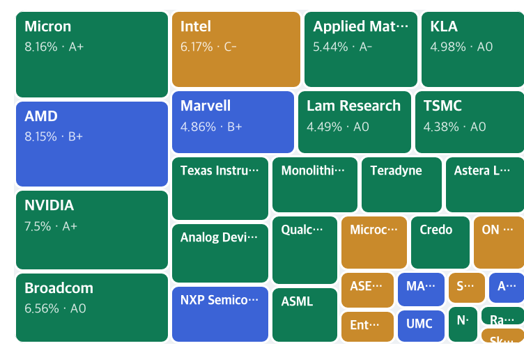

# ETF Research Agent

근거, 구성종목 분석, 데이터 누락까지 기록하는 ETF 리서치 에이전트.

[English](README.md) · 한국어

[](https://github.com/jingi723/etf-research-agent/actions/workflows/checks.yml)
[](LICENSE)
[](https://www.python.org/downloads/)

**ETF 분석의 결론뿐 아니라, 근거와 모르는 것까지 확인하세요.**

Claude Code용 ETF 리서치 에이전트입니다. 15개 에이전트가
**시장 → 섹터 → 테마 → ETF 후보 → 검증**을 수행하고, Python 도구가
지표 계산과 패턴 백테스트를 담당합니다.

[샘플 실행](#바로-체험하기) · [최종 판단 보고서](examples/full/final_etf_decision.md) ·
[데이터 누락 보고서](examples/full/data_coverage.md) · [설계 문서](docs/ARCHITECTURE.md)



ETF 내부의 구성종목을 비중과 등급으로 살펴보고, 테마·재무·밸류에이션을
독립적으로 평가합니다. 자료가 부족하면 추정으로 채우지 않고 커버리지에 기록합니다.

이런 분석 방식이 유용하다면 **Star로 저장**해 주세요.
직접 실행해 본 피드백과 [작은 기여](CONTRIBUTING.md#good-first-contributions)도 환영합니다.

> 투자 권유가 아닌 리서치 도구입니다. 이미지와 샘플 보고서는 과거 실행 결과이며
> 현재 시장 상태를 나타내지 않습니다.

## 바로 체험하기

Git과 Python 3.9 이상만 있으면 됩니다. 샘플 확인에는 API 키나 Claude Code가 필요 없습니다.

```bash
git clone https://github.com/jingi723/etf-research-agent.git
cd etf-research-agent
python3 -m http.server 8000 --bind 127.0.0.1 --directory examples
```

브라우저에서 **http://127.0.0.1:8000/full/etf_SOXX.html**을 열어 구성종목 맵과
등급 표를 살펴보세요. 종료는 `Ctrl+C`입니다. HTML 파일을 직접 열어도 됩니다.
단일 ETF 상세 페이지 샘플이므로 상위 페이지로 돌아가는 전체 탐색 화면은 포함하지 않습니다.

영문 스캔 샘플은 **http://127.0.0.1:8000/scan/html/scan_SMH.html**에서 볼 수 있습니다.

## 실제 티커 분석하기

라이브 채점과 백테스트에는 해당 엔드포인트에 접근 가능한 **FMP API 키가 필요**합니다.
Python 표준 라이브러리만 사용하므로 별도 패키지 설치는 없습니다.

```bash
cp .env.example .env
# .env의 FMP_API_KEY를 실제 키로 수정한 뒤 실행하세요.
python3 tools/score.py SOXX --horizon swing --holdings
python3 tools/validate.py SOXX --pattern ftd --horizon 10
```

`long`, `swing`, `short` 세 기간의 채점 프로필을 지원합니다.
점수는 조건 충족 정도이며 기대 수익률이나 매수 신호가 아닙니다.
키 없이 백테스터 자체 검사를 실행하려면:

```bash
python3 tools/validate.py --self-check
```

`ok`가 출력되어야 합니다. 키 설정과 데이터 범위는 [API 설정 문서](docs/API_SETUP.md)를 참고하세요.

## 가벼운 스캔부터 시작하기

저장소에서 `claude`를 실행하고 세션에 아래 요청을 입력하세요.
Claude Code 자체 설정과 이용 권한이 필요합니다.

```text
현재 시장에서 검토할 만한 미국 상장 ETF 후보를 발굴해줘.
우선 스캔으로 시작하고, 후보별 현재 상태와 데이터 누락 항목을 정리해줘.
```

기본 실행은 스캔입니다. 구성종목별 심층 검증과 전체 보고서가 필요하면
스캔 결과를 전체 분석으로 확장해 달라고 요청하세요. 에이전트 호출량이 크게
늘어나므로 [실측 실행 비용](docs/RUN_COST.md)을 먼저 참고하세요.

`main`의 에이전트와 스킬 프롬프트는 영어이며, `ko`는 한국어 작업 브랜치입니다.
결과 언어는 요청을 따르므로 `main`에서도 한국어로 요청할 수 있습니다.
샘플 보고서는 영어 전환 이전의 한국어 실행 결과입니다.
웹 도구를 사용할 수 있으면 벤더 API 키 없이 공식 자료를 조사할 수 있습니다.
Python 채점·백테스트 CLI는 FMP를 직접 호출하므로 이 대체 경로가 없습니다.

## 결과에서 확인할 것

| 결과 | 확인할 내용 |
|---|---|
| [섹터·테마 발굴](examples/full/sector_theme_discovery.md) | 어떤 테마가 살아남고 탈락했는가 |
| [ETF 후보](examples/full/etf_candidates.md) | 테마별 상품과 구조는 무엇인가 |
| [최종 판단](examples/full/final_etf_decision.md) | 근거와 리스크가 판단에 어떻게 반영됐는가 |
| [데이터 커버리지](examples/full/data_coverage.md) | 무엇을 확보하지 못했는가 |

방법론, 도구별 사용 예시와 아키텍처는 [영문 README](README.md#the-tools)에 있습니다.
번역, 재현 가능한 버그 제보, 데이터 제공자 개선을 환영합니다.
[기여 안내](CONTRIBUTING.md) · [보안 제보](SECURITY.md) · [MIT 라이선스](LICENSE)
