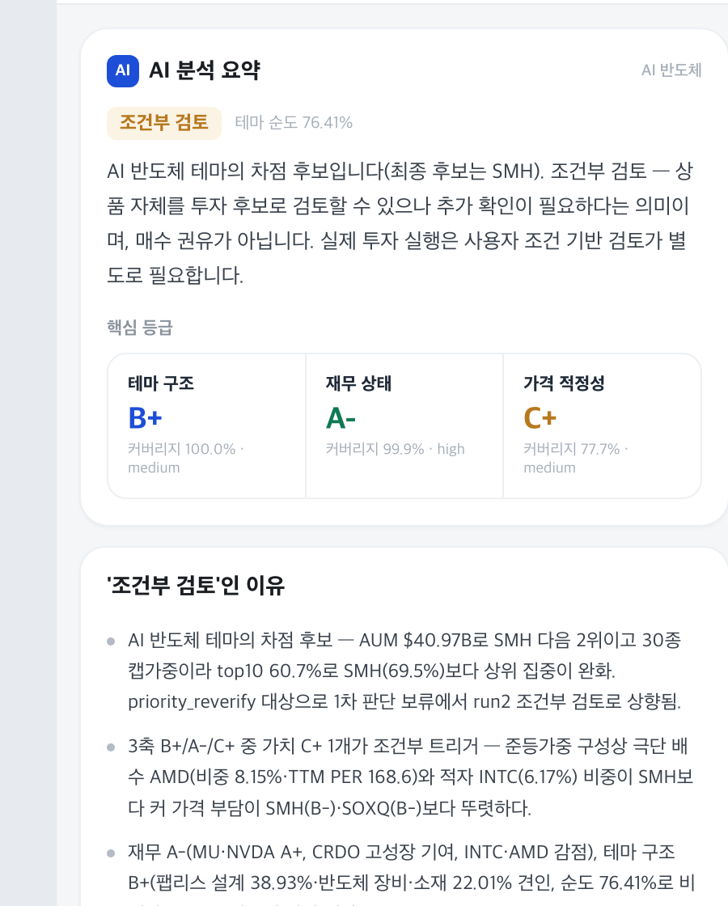

# ETF Discovery Harness

[](LICENSE)
[](https://www.python.org/downloads/)
[](#the-tools)
[](https://claude.ai/code)

A [Claude Code](https://claude.ai/code) harness that narrows the market down to a
short list of ETFs — **market regime → sector → theme → ETF candidates → verification** —
and writes down the evidence, the risks, and what it could not find out.

Fifteen specialised agents and seven skills handle regime diagnosis, theme evidence
collection, holdings-level analysis, three independent grading axes, compliance QA,
and report rendering. The output is never "buy this". Every candidate ends in one of
four states: **worth reviewing / conditional / on hold / low priority**.

> This project produces research notes, not investment advice. Nothing it generates is
> a recommendation to buy or sell any security.

<p align="center">
  
  
</p>
<p align="center">
  <sub>Sample output — the verdict page and the constituent score map, where area is portfolio weight and colour is grade.<br>
  Browse the full run in <a href="examples/">examples/</a>.</sub>
</p>

## Why this exists

Most LLM stock analysis has the same two failure modes. It asserts patterns it never
tested, and it grades everything on one time horizon. This harness is built against
both:

**Patterns must survive a backtest before they may be cited.** Real casualties from
this repo's own notes:

| Claim | Verdict |
|---|---|
| "Gap down closing near the high = institutional accumulation" | 44 events over 1,255 sessions — **worse than baseline**. Dropped. |
| "Volume expansion on a decline signals reversal" | 43% vs 50% hit rate. **No discriminating power.** Dropped. |
| "Follow-Through Days mark the bottom" (O'Neil/IBD) | On SOXX: **−2.47pp vs baseline**. Textbook pattern, inverted on this ticker. |
| "A pullback past the 61.8% Fibonacci retracement is different in kind" | 100% recovery below the line, 36% above it. **Kept.** |

Run these yourself — `tools/validate.py` is the script that killed them.

**Two horizons disagreeing is information, not a bug.** The same two-day rally scored
+7.5 on the one-month profile and −3.6 on the long-term profile, because the rally
improved trend while it destroyed the entry point. A single blended score would have
hidden that. The harness reports which indicator split them.

## Quick start

```bash
git clone https://github.com/jingi723/etf-discovery-harness.git
cd etf-discovery-harness
cp .env.example .env      # optional — see docs/API_SETUP.md
python3 tools/score.py SOXX --horizon swing --holdings
```

The Python tools use **only the standard library** — no `pip install`, no
`requirements.txt`, no virtualenv. Python 3.9+.

To run the full discovery pipeline, open Claude Code in the repo and ask for it:

```bash
claude
> Find ETF candidates worth reviewing in the current market
```

Not ready to install? [`examples/`](examples/) holds a complete run — the four reports,
the coverage log, and an interactive ETF detail page you can open in a browser.

## The tools

Four scripts you can run without Claude Code at all. They are the deterministic core;
the agents call the same logic and explain the output.

### `tools/score.py` — seven indicators, three horizons

```console
$ python3 tools/score.py SOXX --horizon swing

SOXX  2026-09-04  519.86 (+3.52%)
🟡 swing score 40.0/100

  macro        50 pt  (weight 10%) ->  5.00  🟡
  value         0 pt  (weight  5%) ->  0.00  🔵
  trend        25 pt  (weight 25%) ->  6.25  🟢
  momentum     40 pt  (weight 20%) ->  8.00  🟡
  position     75 pt  (weight 20%) -> 15.00  🟠
  rs           25 pt  (weight 15%) ->  3.75  🟢
  flow         40 pt  (weight  5%) ->  2.00  🟡

  ma20 523.42 / ma60 550.72 / ma200 431.53
  20d -4.3%  rs -3.9pp  pos60 29%  from-high -20.7%  vol 0.68x
```

Every horizon scores the *same* seven indicators — macro, valuation, trend, momentum,
range position, relative strength, flows — so you can point at the one indicator that
made two horizons disagree. Only the weights change:

| Indicator | `--horizon long` | `--horizon swing` | `--horizon short` |
|---|---:|---:|---:|
| Macro | 40 | 10 | 5 |
| Valuation | 15 | 5 | 0 |
| Trend | 15 | 25 | 25 |
| Momentum | 5 | 20 | 25 |
| Range position | 15 | 20 | 20 |
| Relative strength | 5 | 15 | 15 |
| Flows | 5 | 5 | 10 |

Macro carries 40% at the long horizon because rates set the direction and the chart
only sets the entry. Valuation is worth 0 at the short horizon because multiples do
not move in a week. Leveraged ETFs default to the short profile.

`--holdings` also scores the ETF's top constituents and reports **breadth** — how many
are actually in an uptrend. An index holding up while six of its eight largest holdings
roll over is a retracement, not a bottom.

Colour bands follow the Korean market convention, where **red is positive**:
`🔴 80+ / 🟠 60–80 / 🟡 40–60 / 🟢 20–40 / 🔵 0–20`. The score is a measure of how many
conditions are met — not an expected return.

### `tools/validate.py` — backtest before you believe

```console
$ python3 tools/validate.py SOXX --pattern ftd --horizon 10

SOXX  2021-09-07 -> 2026-09-04  (1255 sessions)  10-day forward return

  ftd                    n=43    mean  -1.27%  median  -2.00%  win  37.2%
  baseline (any day)     n=1245  mean  +1.19%  median  +1.14%  win  56.5%

  edge -2.47pp over baseline  ->  INVERTED — it predicts the opposite of the folklore
```

Patterns: `ftd` (O'Neil follow-through day), `distribution` (IBD distribution-day
count), `fib618` (61.8% retracement break), `touch200`, `golden_cross`. Every run
prints the pattern's forward return next to the return of picking a random day. If it
does not beat the baseline, it is noise — and the script says so.

### `tools/render.py` — payload to static HTML

Turns the pipeline's `ui_payload.json` into self-contained mobile pages — a constituent
treemap sized by weight and coloured by grade, plus a single-document print version for
PDF export. Deterministic: the same payload produces byte-identical HTML.

```bash
python3 tools/render.py path/to/ui_payload.json -o ./html
```

It copies payload values verbatim and computes nothing, which is why no agent reviews
its output — a renderer that cannot invent a grade cannot misreport one. The pages at
the top of this README came out of it; open
[`examples/etf_SOXX.html`](examples/etf_SOXX.html) to click through one.

### `tools/data.py` — market data, two optional backends

Selected automatically by which environment variables are set. Handles gzip, 429
backoff, and disk-caches the Toss OAuth token (Toss issues **one valid token per
client**, so a fresh token silently invalidates the one another process is holding).

## Repository layout

```text
.
├── tools/                              # stdlib-only Python — runs without Claude Code
│   ├── data.py                         # FMP + Toss Securities providers
│   ├── score.py                        # 7 indicators × 3 horizons
│   ├── validate.py                     # pattern backtester
│   └── render.py                       # ui_payload.json → static HTML
├── .claude/
│   ├── agents/                         # 15 specialised agent definitions
│   └── skills/
│       ├── etf-discovery-orchestrator/ # main entry point, 13-phase pipeline
│       ├── etf-signal-scoring/         # the 7-indicator framework
│       ├── etf-evidence-standards/     # sourcing, tiers, source-conflict handling
│       ├── etf-grading-standards/      # grade arithmetic + scripts
│       ├── etf-compliance-rules/       # banned phrasing, four-state verdicts
│       ├── etf-report-templates/       # report contracts
│       └── etf-ui-render/              # WebView / PDF / PNG / DOCX rendering
├── examples/                           # a complete run, kept as a snapshot
├── docs/
│   ├── API_SETUP.md                    # FMP and Toss setup, coverage matrix
│   ├── METHODOLOGY.md                  # how a judgment is actually produced
│   └── HARNESS_DESIGN.md               # architecture and data contracts
└── CLAUDE.md                           # trigger pointers and change log
```

**The agent prompts are written in Korean.** They are the working prompts behind two
months of live use, and translating them would mean shipping untested text. The
documentation, the tools, and the code comments are English. Claude reads both fine;
a translation PR is welcome (see [CONTRIBUTING.md](CONTRIBUTING.md)).

## The discovery pipeline

```text
market regime
  → sector scoring
  → theme discovery + two-sided evidence
  → theme selection
  → ETF candidate search
  → holdings & value-chain mapping
  → three independent axes: theme structure / financials / valuation
  → ETF structure & tradability hard gate
  → four-state decision gate
  → report QA
  → mobile WebView + print HTML QA
  → PDF / PNG / DOCX export
```

| Stage | Agents |
|---|---|
| Market & sector | `market-regime-analyst`, `sector-scorer` |
| Theme discovery | `theme-discoverer`, `theme-evidence-collector`, `theme-ranker` |
| ETF candidates | `etf-candidate-finder`, `value-chain-mapper` |
| Independent grading | `theme-structure-scorer`, `holdings-financial-scorer`, `holdings-valuation-scorer` |
| Decision & reporting | `etf-evaluator`, `decision-gate`, `report-generator`, `qa-compliance-guard` |
| Rendering | `ui-payload-builder`, then `tools/render.py` (a script, not an agent) |

The three grading axes are deliberately forbidden from reading each other. A great
theme story must not quietly upgrade a stretched multiple.

Details: [docs/HARNESS_DESIGN.md](docs/HARNESS_DESIGN.md).

## Design principles

- **Scores come from scripts, explanations come from the model.** If the model picks
  the final grade by intuition, the result moves between runs and the reasoning cannot
  be traced.
- **Missing data is recorded, never estimated.** Coverage below 60% suspends the grade
  outright.
- **Negative evidence is mandatory.** An evidence pack with zero negative findings is
  marked incomplete, not clean.
- **Conflicting sources are both kept**, along with the reason one was used.
- **Levels are quoted on the underlying index, never the leveraged vehicle.** Path
  dependency means the same index level maps to a different SOXL price every time.
- **"Worth reviewing" is not a buy.** Position sizing, holding period and loss
  tolerance are a separate step this harness does not perform.

## Requirements

- Python 3.9+ (standard library only)
- [Claude Code](https://claude.ai/code) — for the agent pipeline, not for the tools
- Optional: an [FMP](https://financialmodelingprep.com/) key — see [docs/API_SETUP.md](docs/API_SETUP.md)
- Optional: Chrome/Chromium for PDF and PNG export, pandoc or `textutil` for DOCX

Without an API key the harness still runs, using official issuer, exchange and
filing sources, and marks whatever it could not obtain as a coverage gap rather than
guessing.

## Contributing

Pattern contributions are especially welcome — but a new pattern needs a
`tools/validate.py` run showing it beats baseline. See
[CONTRIBUTING.md](CONTRIBUTING.md) and [SECURITY.md](SECURITY.md).

## Acknowledgements

Repository structure and documentation layout follow
[revfactory/webtoon-harness](https://github.com/revfactory/webtoon-harness).

## License

[MIT](LICENSE)
