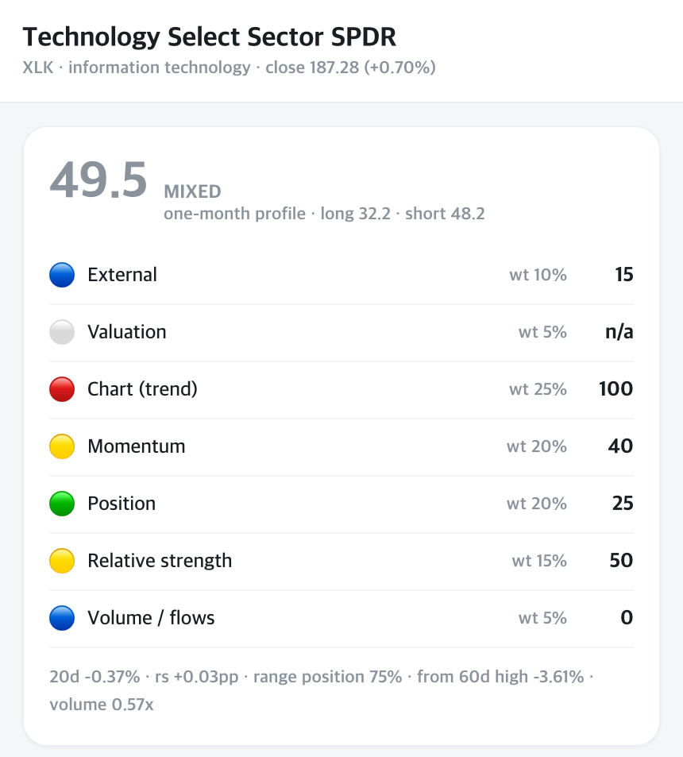
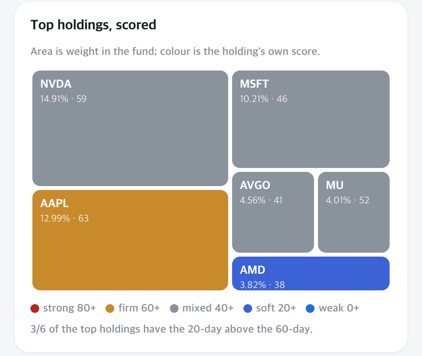

# ETF Discovery Harness

[](LICENSE)
[](https://www.python.org/downloads/)
[](#the-tools)
[](https://claude.ai/code)

A [Claude Code](https://claude.ai/code) harness that narrows the market down to a
short list of ETFs — **market regime → sector → theme → ETF candidates → verification** —
and writes down the evidence, the risks, and what it could not find out.

Fifteen specialised agents and seven skills handle regime diagnosis, theme evidence
collection, holdings-level analysis, three independent grading axes, compliance QA,
and report rendering. The output is never a recommendation to buy — every candidate ends
in one of four states: **worth reviewing / conditional / on hold / low priority**.

> This project produces research notes, not investment advice. Nothing it generates is
> a recommendation to buy or sell any security.

<p align="center">
  
</p>
<p align="center">
  
</p>
<p align="center">
  <sub><b>The default output.</b> Every indicator carries its own score, weight and colour;
  the constituent colours come from scoring each holding rather than from eye.<br>
  Colours follow the Korean market convention, where red is the strong end.</sub>
</p>

<p align="center">
  
</p>
<p align="center">
  <sub><b>What the full pipeline adds.</b> The same map, coloured by a graded financial
  assessment of each holding instead of a price signal — Micron at 8.16% carries an A+,
  Intel at 6.17% a C−. Sixty agents rather than three. Both are real output; see
  <a href="examples/">examples/</a>.</sub>
</p>

## Why this exists

Most LLM stock analysis has the same two failure modes. It asserts patterns it never
tested, and it grades everything on one time horizon. This harness is built against
both:

**Patterns must survive a backtest before they may be cited.** Real casualties from
this repo's own notes:

| Claim | Verdict |
|---|---|
| "Gap down closing near the high = institutional accumulation" | 44 events over 1,255 sessions — **worse than baseline**. Dropped. |
| "Volume expansion on a decline signals reversal" | 43% vs 50% hit rate. **No discriminating power.** Dropped. |
| "Follow-Through Days mark the bottom" (O'Neil/IBD) | On SOXX: **−2.47pp vs baseline**. Textbook pattern, inverted on this ticker. |
| "A pullback past the 61.8% Fibonacci retracement is different in kind" | 100% recovery below the line, 36% above it. **Kept.** |

Run these yourself — `tools/validate.py` is the script that killed them.

**Two horizons disagreeing is information, not a bug.** The same two-day rally scored
+7.5 on the one-month profile and −3.6 on the long-term profile, because the rally
improved trend while it destroyed the entry point. A single blended score would have
hidden that. The harness reports which indicator split them.

## Quick start

```bash
git clone https://github.com/jingi723/etf-discovery-harness.git
cd etf-discovery-harness
cp .env.example .env      # optional — see docs/API_SETUP.md
python3 tools/score.py SOXX --horizon swing --holdings
```

The Python tools use **only the standard library** — no `pip install`, no
`requirements.txt`, no virtualenv. Python 3.9+.

To run the full discovery pipeline, open Claude Code in the repo and ask for it:

```bash
claude
> Find ETF candidates worth reviewing in the current market
```

Not ready to install? [`examples/`](examples/) holds one real run per depth — a
[scan](examples/scan/scan_result.md) (two agents, ranked funds with per-indicator
scores) and a [full run](examples/full/) (the five reports plus an interactive ETF
detail page).

## The tools

Eight scripts you can run without Claude Code at all. They are the deterministic core;
the agents call the same logic and explain the output.

### `tools/score.py` — seven indicators, three horizons

```console
$ python3 tools/score.py SOXX --horizon swing

SOXX  2026-09-04  519.86 (+3.52%)
🟡 swing score 42.1/100  (95% of weight has data)

  macro        50 pt  (weight 10%) ->  5.26  🟡
  value       n/a  (weight  5%) -> excluded, renormalised
  trend        25 pt  (weight 25%) ->  6.58  🟢
  momentum     40 pt  (weight 20%) ->  8.42  🟡
  position     75 pt  (weight 20%) -> 15.79  🟠
  rs           25 pt  (weight 15%) ->  3.95  🟢
  flow         40 pt  (weight  5%) ->  2.11  🟡

  ma20 523.42 / ma60 550.72 / ma200 431.53
  20d -4.3%  rs -3.9pp  pos60 29%  from-high -20.7%  vol 0.68x
```

Every horizon scores the *same* seven indicators — macro, valuation, trend, momentum,
range position, relative strength, flows — so you can point at the one indicator that
made two horizons disagree. Only the weights change:

| Indicator | `--horizon long` | `--horizon swing` | `--horizon short` |
|---|---:|---:|---:|
| Macro | 40 | 10 | 5 |
| Valuation | 15 | 5 | 0 |
| Trend | 15 | 25 | 25 |
| Momentum | 5 | 20 | 25 |
| Range position | 15 | 20 | 20 |
| Relative strength | 5 | 15 | 15 |
| Flows | 5 | 5 | 10 |

Macro carries 40% at the long horizon because rates set the direction and the chart
only sets the entry. Valuation is worth 0 at the short horizon because multiples do
not move in a week. Leveraged ETFs default to the short profile.

**One weight moves with the state.** Valuation matters little while a company earns
and a great deal once it stops, so a loss carries 30% instead of 5% and the rest scale
down. A refiner with a perfect chart, perfect momentum and perfect relative strength
scores 80 on a profit and **58.9** on a loss — out of the second band entirely. That is
the point: a score above 60 reads as investable, and a loss-making company should not
land there on price action alone.

It is a condition, not a curve, and there is exactly one of them. Every condition added
costs explainability, and a rule nobody can state in one sentence is overfitting in a
good suit.

`--holdings` scores each of the top constituents the same way and reports **breadth** —
how much of the weight is actually in an uptrend. An index holding up while its largest
holdings roll over is a retracement, not a bottom.

A constituent is scored on the same profile minus macro, which is the one hand-supplied
input and cannot be entered per holding. **Valuation stays in.** Leaving it out is what
let a loss-making refiner show a top-band colour on chart strength alone — it scores 82
on price action and 78 once the negative P/E is counted, and the row now says
`loss-making` beside it.

Colour bands follow the Korean market convention, where **red is positive**:
`🔴 80+ / 🟠 60–80 / 🟡 40–60 / 🟢 20–40 / 🔵 0–20`. The score is a measure of how many
conditions are met — not an expected return.

An indicator with no data is excluded and the remaining weights are renormalised, with
the coverage stated — never filled in with a neutral guess. Below 60% coverage the score
is suspended outright. (ETFs have no P/E of their own, which is why `value` reads `n/a`
above; the pipeline scores an ETF's valuation from its holdings instead.)

### `tools/validate.py` — backtest before you believe

```console
$ python3 tools/validate.py SOXX --pattern ftd --horizon 10

SOXX  2021-09-07 -> 2026-09-04  (1255 sessions)  10-day forward return

  ftd                    n=43    mean  -1.27%  median  -2.00%  win  37.2%
  baseline (any day)     n=1245  mean  +1.19%  median  +1.14%  win  56.5%

  edge -2.47pp over baseline  ->  INVERTED — it predicts the opposite of the folklore
```

Patterns: `ftd` (O'Neil follow-through day), `distribution` (IBD distribution-day
count), `fib618` (61.8% retracement break), `touch200`, `golden_cross`. Every run
prints the pattern's forward return next to the return of picking a random day. If it
does not beat the baseline, it is noise — and the script says so.

### `tools/eventstudy.py` — does the score forecast anything?

It does not, and this script is how we found out.

```console
$ python3 tools/eventstudy.py ic

  🔴 80+          437   +0.45%   50.8%
  🟠 60-80      7,224   +1.08%   55.8%
  🟡 40-60      9,797   +1.51%   58.7%
  🟢 20-40      2,999   +2.19%   60.5%
  all          20,460   +1.44%   57.7%

  IC (score vs forward return) = -0.0647
```

Over 20,460 observations the composite score runs *inverse* to the next month's return.
The score describes the present accurately; it was never a forecast, and reading it as
one is the mistake.

What the indicators *can* do is filter after an event. Following a 2σ down-shock, the
prior 120-day trend separates the recoveries from the continuations by **+2.76pp**,
monotonically across quartiles — a wider spread than the same indicator gets
unconditionally. After an *up*-shock the same split is worth +0.10pp: charts cannot tell
you how far good news travels. That one gap is the entire case for a news pipeline, and
it says exactly where it belongs.

The `self-check` mode is the important one. It rebuilds a past-dated indicator, poisons
the latest bar, and asserts the value is unchanged — the standard way a backtest lies to
you is future data leaking into a past date.

[docs/EVENT_STRUCTURE.md](docs/EVENT_STRUCTURE.md) carries all four measurements, the
design conclusions that follow, and the limits — including how unstable these IC
estimates are year to year.

### `tools/structure.py` — the layer between a score and an event

A score says what state something is in. An event moves the price. Between them sits
**structure — an unresolved imbalance**, which sets both the *sign* of the events a
market will produce and how *soon* they must arrive.

```console
$ python3 tools/structure.py --eia

[US petroleum inventories] EIA weekly, week ending 8/28/26, million bbl
                                        now   wk chg    yr ago     YoY
  🟡 Commercial (Excluding SPR)       424.5     -4.5     420.7   +0.9%
  🔴 SPR                              286.6     -3.1     404.7  -29.2%
  🟠 Distillate Fuel Oil              104.2     +0.8     115.9  -10.1%

[US domestic demand] product supplied, thousand b/d -- exports excluded
                                    week   yr ago     YoY     4wk avg   yr ago     YoY
  🟡 Distillate Fuel Oil           3,390    3,768  -10.0%       3,660    3,894   -6.0%

[3-2-1 crack spread] Gulf Coast, per barrel -- normal range $20-40
     date            WTI  gasoline   diesel    crack     chg
  🔴 Fri 8/28      84.57     3.742    4.346    81.05   +4.33
```

Crude inventories sit 1% above the five-year average while distillate is at its lowest
seasonal level since the 1980s and refining margin runs two to four times normal. That
is not a crude shortage; it is a shortage of the plants that turn crude into diesel.
Inventories alone could not have told you that — you need demand next to them.

`--fred` pulls capacity utilisation and the production index; passing tickers or `--etf`
computes days of inventory, margin trend, and **tension** from company filings:

```
tension = buffer / drawdown rate = time remaining
```

Days of inventory alone flips sign in a price spike, because balance-sheet inventory is
carried at cost. So tension reads inventory **together with margin**, and when margin
expands while inventory days rise it reports *undetermined* rather than *easing*.

All of it is free and needs no API key. [docs/EVENT_STRUCTURE.md](docs/EVENT_STRUCTURE.md)
carries the measurements and the reasoning.

### `tools/render.py` — payload to static HTML

Turns the pipeline's `ui_payload.json` into self-contained mobile pages — a constituent
treemap sized by weight and coloured by grade, plus a single-document print version for
PDF export. Deterministic: the same payload produces byte-identical HTML.

```bash
python3 tools/render.py path/to/ui_payload.json -o ./html
```

It copies payload values verbatim and computes nothing, which is why no agent reviews
its output — a renderer that cannot invent a grade cannot misreport one. The treemap at
the top of this README came out of it; open
[`examples/etf_SOXX.html`](examples/etf_SOXX.html) to click through the whole page.

The sample run's prose is Korean, like the agent prompts — see the note below.

### `tools/render_scan.py` — scan scores to static HTML

The full pipeline's payload carries three grading axes and value chains; a scan carries
neither, so `render.py` cannot read it. This renders the scan's own shape — indicator
rows with their bands, and a treemap coloured by each holding's score rather than by a
grade. The two images at the top of this README came out of it.

```bash
python3 tools/render_scan.py _workspace/12b_signal_scores.json \
    --gate _workspace/11_structure_gate.json -o html/
```

### `tools/data.py` — market data, two optional backends

Selected automatically by which environment variables are set. Handles gzip, 429
backoff, and disk-caches the Toss OAuth token (Toss issues **one valid token per
client**, so a fresh token silently invalidates the one another process is holding).

It also counts your API calls, because the free tier's daily cap binds long before
anything else does — `data.call_summary()` at any point, or `ETF_API_LOG=path.jsonl`
for a log that survives across processes. A plain `score.py` run costs 3 calls; with
`--holdings` it costs 15. See [docs/RUN_COST.md](docs/RUN_COST.md).

## Repository layout

```text
.
├── tools/                              # stdlib-only Python — runs without Claude Code
│   ├── data.py                         # FMP + Toss Securities providers
│   ├── score.py                        # 7 indicators × 3 horizons
│   ├── validate.py                     # pattern backtester
│   ├── eventstudy.py                   # does the score forecast? (it does not)
│   ├── structure.py                    # inventory, margins, tension; EIA and FRED
│   ├── render.py                       # full-pipeline payload → static HTML
│   ├── render_scan.py                  # scan scores → static HTML
│   └── check_workspace.py              # validates run output against the contract
├── .claude/
│   ├── hooks/                          # run the checks without being asked
│   ├── agents/                         # 15 specialised agent definitions
│   └── skills/
│       ├── etf-discovery-orchestrator/ # main entry point, 13-phase pipeline
│       ├── etf-signal-scoring/         # the 7-indicator framework
│       ├── etf-evidence-standards/     # sourcing, tiers, source-conflict handling
│       ├── etf-grading-standards/      # grade arithmetic + scripts
│       ├── etf-compliance-rules/       # banned phrasing, four-state verdicts
│       ├── etf-report-templates/       # report contracts
│       └── etf-ui-render/              # WebView / PDF / PNG / DOCX rendering
├── examples/                           # one real run per depth
│   ├── scan/                           # the default path, English
│   └── full/                           # the ~60-agent pipeline
├── docs/
│   ├── API_SETUP.md                    # FMP and Toss setup, coverage matrix
│   ├── RUN_COST.md                     # measured tokens and API calls per run
│   ├── METHODOLOGY.md                  # how a judgment is actually produced
│   ├── EVENT_STRUCTURE.md              # what the indicators can and cannot do
│   └── HARNESS_DESIGN.md               # architecture and data contracts
└── CLAUDE.md                           # trigger pointers and change log
```

**Two branches.** `main` is English — prompts, skills, docs, and tools. `ko` is the
Korean working branch this was built and used in for two months, and it stays the
day-to-day version; `main` is its published translation. Output follows the language you
ask in, so an English request produces an English report on either branch.

The scan example is English; the full-pipeline example predates the translation and is in Korean.

## Two ways in, and two depths

Which path runs is decided by one question: **does the request name a fund?**

```text
"how does SOXX look"          →  score it            3 API calls, 1 turn
"what's worth a look"         →  scan               2-4 agents
"...and I need the evidence"  →  full pipeline      ~60 agents
```

A named ticker never enters the pipeline. It goes straight to the seven-indicator
scoring above and comes back as a judgment block. Routing it into discovery would
spend a market-wide run that might never reach the fund that was asked about.

When no fund is named, discovery runs — sharing its first four phases and then
forking on depth:

```text
market regime → sector scoring
      │
      ├── scan (default) ── representative ETFs per sector → score → judgment blocks
      │
      └── full ─────────── theme discovery + two-sided evidence
                            → theme selection
                            → ETF candidate search
                            → holdings & value-chain mapping
                            → three independent axes: theme structure / financials / valuation
                            → structure & tradability hard gate
                            → four-state decision gate
                            → current-state scoring
                            → report QA → WebView + print HTML → PDF / PNG / DOCX
```

The scan answers *what is worth a look and what state is it in*. The full pipeline
answers *why, with the evidence*, and is the one that produces the five reports. A
scan can be deepened afterwards from the same workspace, so the cheap path is never
a dead end.

**What the scan misses is theme purity.** In one run, two funds that both call
themselves semiconductor ETFs turned out to hold 55% and 50% of their weight
*outside* the theme's own value chain — visible only once every holding is
classified, which is the full pipeline's job.

Every path ends in the same judgment block: one line per indicator with its own
score and colour, constituent colours from scoring rather than from eye, then the
structural reason and a plain-language conclusion.

| Stage | Agents |
|---|---|
| Market & sector (both paths) | `market-regime-analyst`, `sector-scorer` |
| Theme discovery | `theme-discoverer`, `theme-evidence-collector`, `theme-ranker` |
| ETF candidates | `etf-candidate-finder` (takes a sector on the scan, a theme on the full path), `value-chain-mapper` |
| Independent grading | `theme-structure-scorer`, `holdings-financial-scorer`, `holdings-valuation-scorer` |
| Decision & reporting | `etf-evaluator`, `decision-gate`, `report-generator`, `qa-compliance-guard` |
| Rendering | `ui-payload-builder`, then `tools/render.py` (a script, not an agent) |

The three grading axes are deliberately forbidden from reading each other. A great
theme story must not quietly upgrade a stretched multiple.

Details: [docs/HARNESS_DESIGN.md](docs/HARNESS_DESIGN.md). What it costs to run:
[docs/RUN_COST.md](docs/RUN_COST.md) — measured across all ten agent types, plus the
optimisations that were tried and did not work.

## The checks run themselves

Every tool here ships a self-check, and the compliance rules ship a scanner for
recommendation language. Until recently both only ran when the model remembered to
call them — the weakest possible enforcement, since the run that most needs checking
is the run where attention has already slipped.

`.claude/hooks/after_edit.py` is wired as a `PostToolUse` hook on `Write` and `Edit`:

```
tools/*.py edited   ->  run that file's self-check
report .md written  ->  scan it for recommendation language
```

A failure exits 2, which returns the message to Claude as feedback rather than to you
as an error. Everything else exits silently — a hook that chatters gets switched off.
A bug in the hook itself never blocks work.

The self-check that matters most is `eventstudy.py`'s: it rebuilds a past-dated
indicator, poisons the latest bar, and asserts nothing changed. Future data leaking
into a past date is the standard way a backtest flatters itself.

## Design principles

- **Scores come from scripts, explanations come from the model.** If the model picks
  the final grade by intuition, the result moves between runs and the reasoning cannot
  be traced.
- **Missing data is recorded, never estimated.** Coverage below 60% suspends the grade
  outright.
- **Negative evidence is mandatory.** An evidence pack with zero negative findings is
  marked incomplete, not clean.
- **Conflicting sources are both kept**, along with the reason one was used.
- **Levels are quoted on the underlying index, never the leveraged vehicle.** Path
  dependency means the same index level maps to a different SOXL price every time.
- **"Worth reviewing" is not a buy.** Position sizing, holding period and loss
  tolerance are a separate step this harness does not perform.

## Requirements

- Python 3.9+ (standard library only)
- [Claude Code](https://claude.ai/code) — for the agent pipeline, not for the tools
- Optional: an [FMP](https://financialmodelingprep.com/) key — see [docs/API_SETUP.md](docs/API_SETUP.md)
- Optional: Chrome/Chromium for PDF and PNG export, pandoc or `textutil` for DOCX

Without an API key the harness still runs, using official issuer, exchange and
filing sources, and marks whatever it could not obtain as a coverage gap rather than
guessing.

## Contributing

Pattern contributions are especially welcome — but a new pattern needs a
`tools/validate.py` run showing it beats baseline. Open PRs against `main`. See
[CONTRIBUTING.md](CONTRIBUTING.md) and [SECURITY.md](SECURITY.md).

## Acknowledgements

Repository structure and documentation layout follow
[revfactory/webtoon-harness](https://github.com/revfactory/webtoon-harness).
The hook design — running the repo's own checks on edit rather than on request —
follows [wnghdcjfe/stock-report-harness](https://github.com/wnghdcjfe/stock-report-harness).

## License

[MIT](LICENSE)
